# Blogz
A Python-Flask web application where multiple users can create their own Blog (updated to use Flask blueprints and Bootstrap CSS).  

*This was originally a homework assignment for LaunchCode's Lc101 (2018)*

## Technologies Used
Python (Flask)
Bootstrap
HTML/CSS
MySQL

# Home / Bloggers Page (Before Sign up)
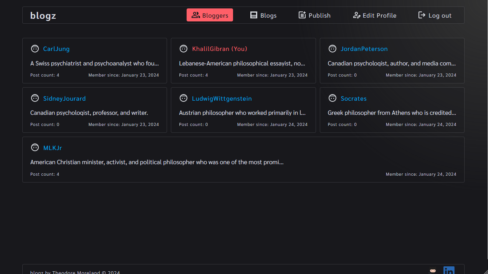

# Log In Page
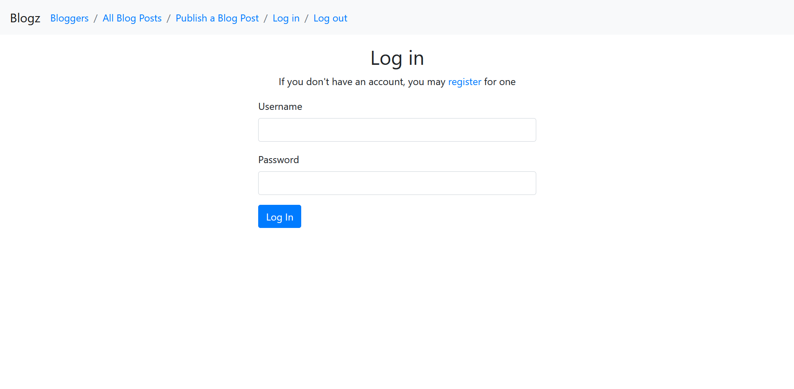

# Sign Up Page (making account for Carl Jung)
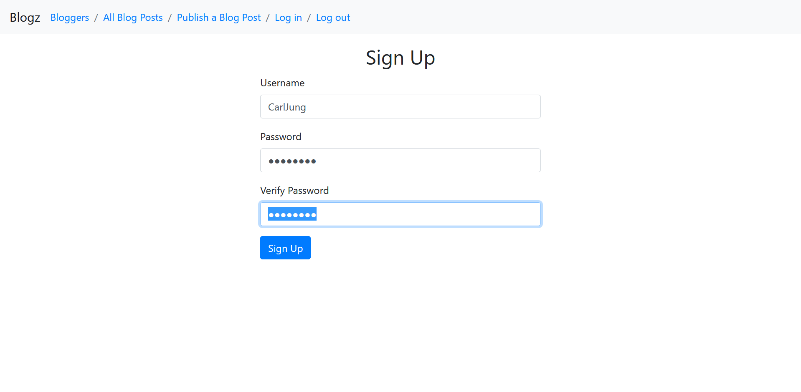

# Account for Carl Jung has been created
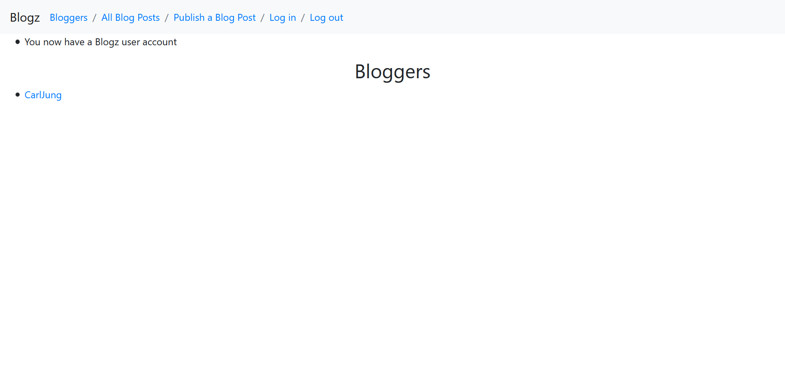

# Home / Bloggers Page (After multiple sign ups)
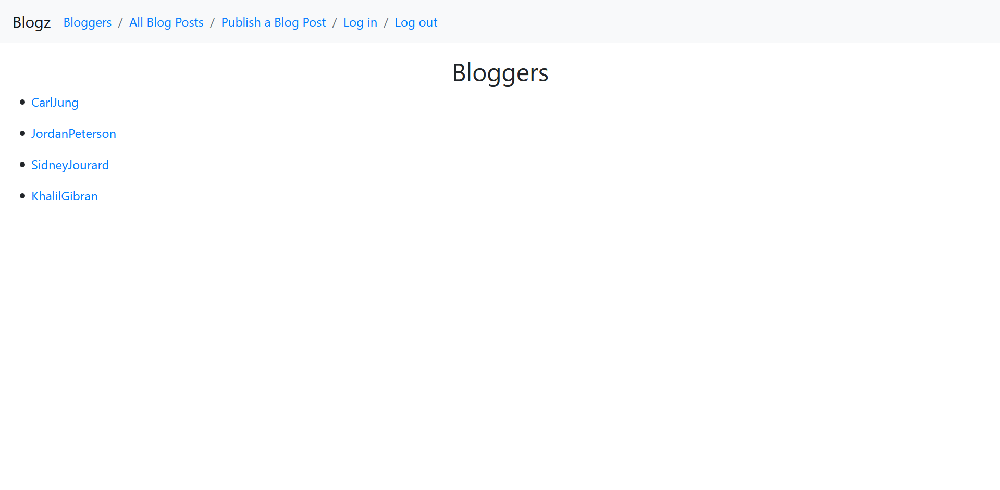

# Publishing a blog post (as Carl Jung)
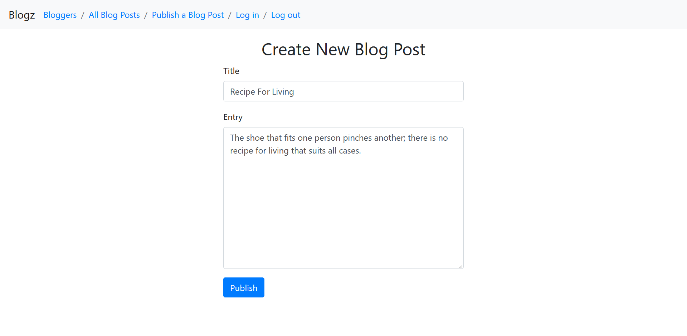

# After publishing post
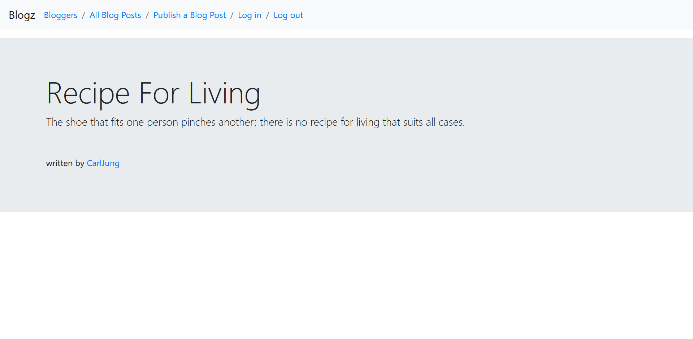

# View of Carl Jung's Blog after first post
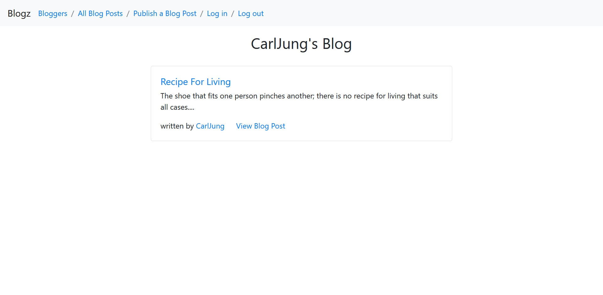

# View of Carl Jung's Blog after multiple posts
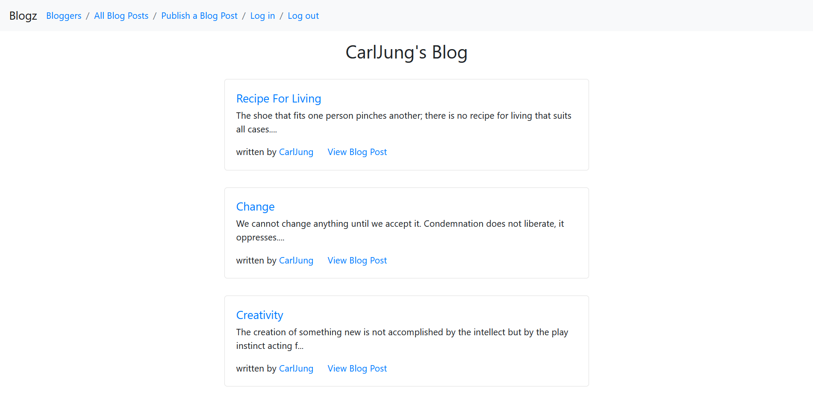

# All Posts - Animated - (multiple users) 
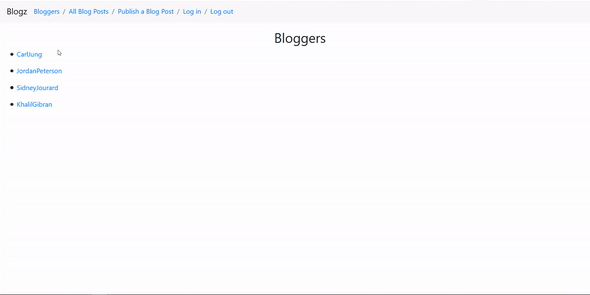

# View #1 All Post (multiple users)
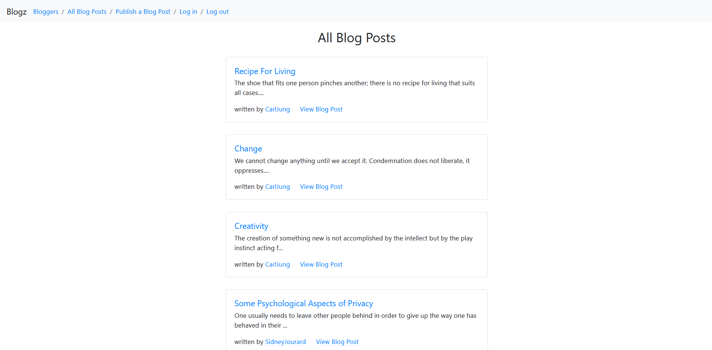

# View #2
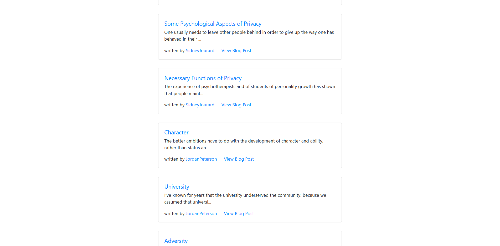

# View #3
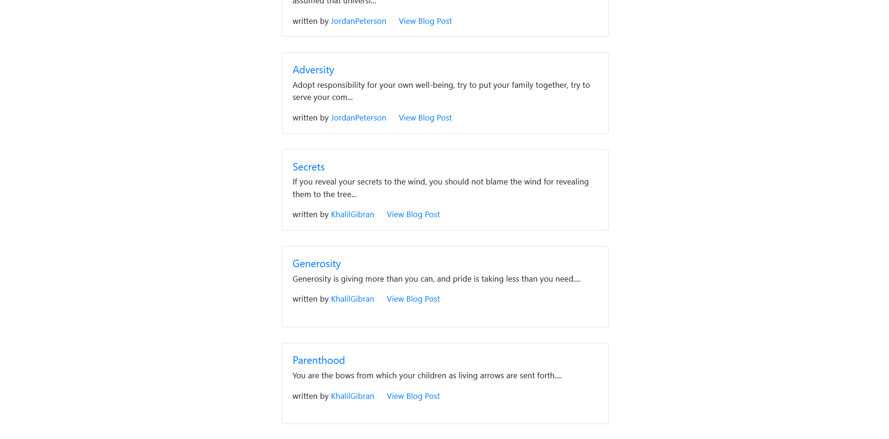

# Favorite Posts
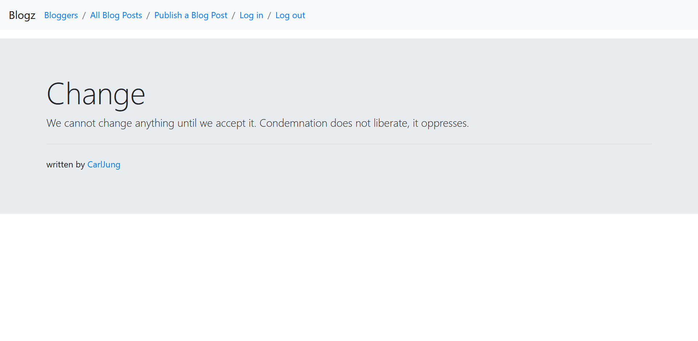
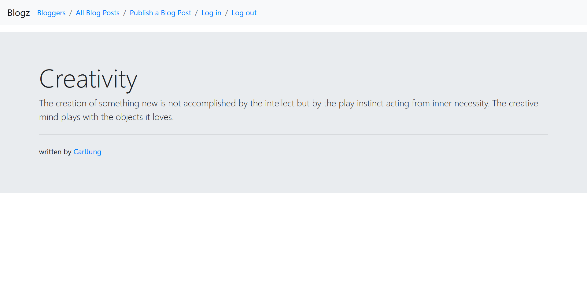
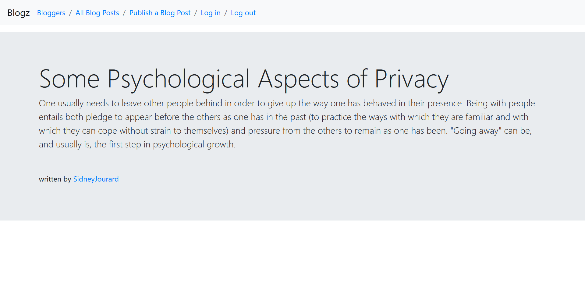
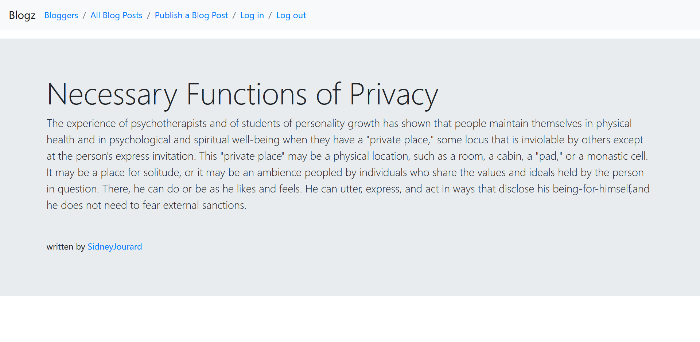
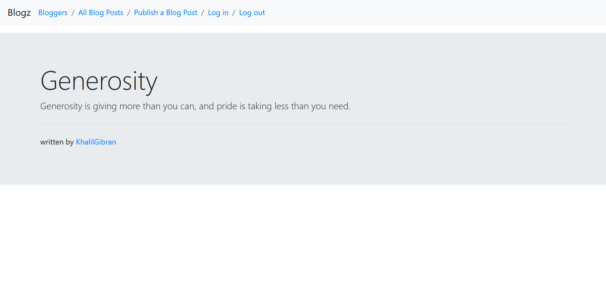
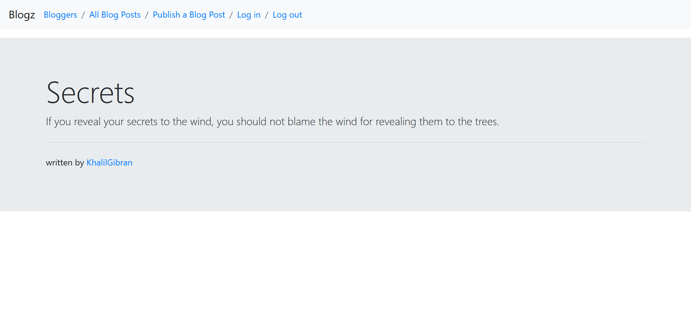
