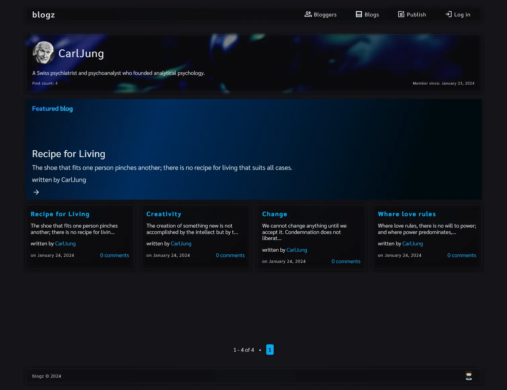

# Blogz

A rudimentary Python (Flask) web application where multiple users can create their own Blog (updated to use Flask blueprints). See below for a preview of the application.

_This was originally a homework assignment for LaunchCode's Lc101 (2018)_



# Table of contents

-   [Technologies Used](#technologies-used)
-   [How to run locally](#how-to-run-locally)
    -   [Run on Windows](#run-on-windows)
    -   [Run on Docker](#run-on-docker)
-   [Screenshots](#screenshots)
    -   [Desktop](#desktop)
    -   [Mobile](#mobile)

## Technologies Used

-   Python
-   Flask
-   Flask_sqlalchemy
-   PostgreSQL
-   HTML/CSS
-   Jinja2
-   Docker
-   bcrypt

# How to run locally

Whether you are running the app directly on a Windows OS or indirectly via Docker, there are a few things you need to do in order to setup the application:

-   You need your own PostgreSQL database instance.
-   You need to create a folder named `instance` in the `application` folder. Then create a file called `config.cfg` in `application/instance/` mimicking the template provided in `application/instance_example/config.cfg.example` wherein the empty strings are replaced with values relating to your instance's secret key and PostgreSQL URI.
-   If you are trying to run this application directly on a Windows OS, you will need to install `Python 3.11`.
-   Otherwise, you will need to install Docker so you can run the application through Docker.

## Run on Windows

Assumes you are using a modern Windows client OS such as Windows 11 or Windows 10 and that Python 3.11 is installed.

**It is assumed the user is at the root of this project and is using a UNIX style command line environment when referencing the CLI commands below.**

Open terminal at root of this project then move into application/ directory:

```
cd application/
```

Create venv folder in application folder using Python 3.11:

```
python3.11 -m venv venv
```

Activate venv:

```
source venv/Scripts/activate
```

Install python packages to venv:

```
pip install -r requirements.txt
```

Start application:

```
python application.py
```

## Run on Docker

Firstly, confirm that Docker is installed and running. Next confirm that no other application is using port `5000` as port `5000` is needed for the Flask server. If you need to run Flask on an alternative port, you can modify the last line in the `application/application.py` file and the ports in the `docker/docker-compose.yml` file.

**It is assumed the user is at the root of this project and is using a UNIX style command line environment when referencing the CLI commands below.**

Open terminal at root of this project then move into docker/ directory:

```
cd docker/
```

Build Docker image and start Docker container:

```
docker compose up --build
```

Visit: http://localhost:5000 to use the application.

# Screenshots

## Desktop

### Home / Bloggers Page


